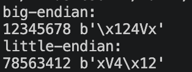
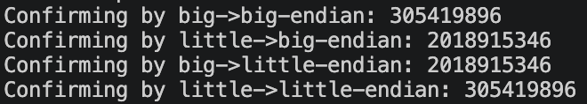

# Part 1: Integer Endianness

## What is endianness?

An integer larger than one byte must be stored as a sequence of bytes. **Endianness** defines which byte is stored first:

- **Big-endian:** the most significant byte comes first.
- **Little-endian:** the least significant byte comes first.

In order to test how it works in code i definded sample **x = 0x12345678** to test out how little and big endian interpret it

First lets see how different endians interpret order of bytes in this value:




Neither representation is wrong, both give the same numeric value when it is decoded using the same byte order. Only the order in which the bytes are stored changes.

The statement `x.to_bytes(4, byteorder="big")` converts `x` into four bytes with the most significant byte first. Using `byteorder="little"` reverses byte order therefore we see that each byte is correct `78`, `56` and etc., but their order is reversed.

To switch from byte to value we can use `from_bytes()` and inside it specify order type:

```python
print("big-endian:")
print(x.to_bytes(4, byteorder="big").hex(),x.to_bytes(4, byteorder="big"))
print("little-endian:")
print(x.to_bytes(4, byteorder="little").hex(),x.to_bytes(4, byteorder="little"))
```

This code takes byte representation and returns an integer. Matching conversions preserve the original value:



As seen if the byte order used for decoding does not match the order used for encoding, the bytes are interpreted incorrectly

## Use Cases
As known network systems use big endian while average hardware uses little endian. In order to compare how they would work if there wont be any translator between them to transfer from big to little endian we can use case from code below:

```python
print("Confirming by big->little-endian: " + str(int.from_bytes(x.to_bytes(4, byteorder="big"), byteorder="little")))
```

or from opposite case if we go from hardware to network:

```python
print("Confirming by little->big-endian: " + str(int.from_bytes(x.to_bytes(4, byteorder="little"), byteorder="big")))
```

both cases produce wrong outputs of
`2018915346`

while correct conversions like:
```python
print("Confirming by little->little-endian: " + str(int.from_bytes(x.to_bytes(4, byteorder="little"), byteorder="little")))
print("Confirming by big->big-endian: " + str(int.from_bytes(x.to_bytes(4, byteorder="big"), byteorder="big")))
```
give:
`305419896`

what can be proved by:
```python
print("Hardware print(little-endian): " + str(x))
```

