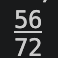
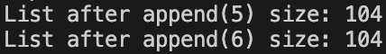
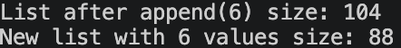

# Part 2: Memory Usage of Tuples and Lists in Python 

## What is different in code?

After taking code provided in task and fixing some particular elements we get version where we print size of tuple and list with same values stored

```python
tpl = (1,2,3)
print(tpl.__sizeof__())
lst = [1,2,3]
print(lst.__sizeof__())
```

This code outputs 2 different values:



We see that size of tuple is lower than size of list but what is the reason?

## Difference between tuple and list

Both objects store references to the same integer objects .

Howevere, since a tuple is a fixed-size, ordered collection, once it is created, its elements cannot be added, removed, replaced and etc. Therefore, its size does not need to change, Python can store its element references in a compact fixed layout.

A list on other hand is a mutable, ordered collection. To make these operations efficient, Python usually allocates extra capacity beyond the current number of elements.

## Measuring memory correctly

```python
#mutability example
lst.append(4)
print(lst.__sizeof__())
```

We can see that in lists we can easily extend them by using append logic to add elements yet one of the interesting somparisons can be seen if we compare how list and tuple operate

when we allocate place in list it already takes place for future values therefore in some cases when we append values memory allocation may not change

```python
# Test how memory allocation works as the list grows.
lst.append(5)
print("List after append(5) size:", lst.__sizeof__())

lst.append(6)
print("List after append(6) size:", lst.__sizeof__())
```


Another interesting finding that 2 lists with same amount of elements in them can have different size, like in case

```python
lst.append(6)
print("List after append(6) size:", lst.__sizeof__())

lst_1 = [1, 2, 3, 4, 5, 6]
print("New list with 6 values size:", lst_1.__sizeof__())
```
We assume that lst and lst_1 may have same size since amount of ekements is same yet due to way python allocates space to lists they have different sizes



this happend since when you append to a list, memory is over-allocated to the list for performance reasons so that multiple appends would not require corresponding reallocations of memory for the list which would slow the overall performance in the case of repeated appends

While numbers on their own may varry depending on python version the process is almost the same for all version of python and most of other languages
