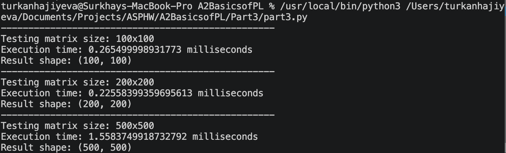
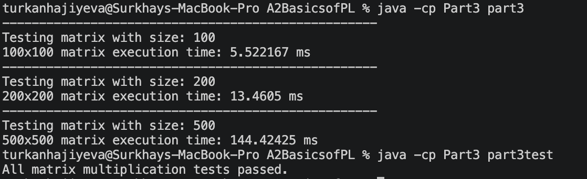

# Part 3: Matrix Multiplication 

## Implementation in Python

For python implementation is quite easy. After defining numpy library and time library we can start with implementation of logic.

In my case I decided to test performance of java na numpy solutions on arrays of 100 200 and 500. Therefore i added random function to create numbers.

```python
start = time.perf_counter()
C = np.matmul(A, B)
end = time.perf_counter()
```
(time should only count multiplication part and nothing else)

Matrix multiplication is performed using numpy internal function `matmul()` and therefore heavily optimized for performing equations like this

## Implementation in Java

In java on other hand we have case when same logic has to be implemented using 3 loops nested in each other creating O(n^3) time complexity in implementation of function

```java
for (int i = 0; i < rowsA; i++) {
    for (int j = 0; j < colsB; j++) {
        for (int k = 0; k < colsA; k++) {
            C[i][j] += A[i][k] * B[k][j];
        }
    }
}
```

additional steps, like checking for sizes of matrixes also adds additional overhead to process

```java
int rowsA = A.length;
int colsA = A[0].length;

int rowsB = B.length;
int colsB = B[0].length;

if (colsA != rowsB) {
    throw new IllegalArgumentException(
            "Wrong dimensions"
    );
}
```

## Tests in Java

Since i didn't have maven installed on my laptop, I had to test without JUnit tests using calls instead.

```java
        testSmallMatrix();
        testIdentityMatrix();
        testZeroMatrix();
        testRectangularMatrices();
        testInvalidDimensions();
        System.out.println("All matrix multiplication tests passed.");
```

Overally tests check for basic cases and compare if calculations satisfy test requirements. For example in case with test `testIdentityMatrix` 
```java
private static void testIdentityMatrix() {

    double[][] A = {
            {1, 2},
            {3, 4}
    };

    double[][] identity = {
            {1, 0},
            {0, 1}
    };

    double[][] result =
                part3.multiply(A, identity);

    assertMatrixEquals(A, result);
}
```

since we use perform matrix multiplication on identity matrix, expected answer is matrix `A` itself, so we have to compare if `part3.multiply(A, identity);` equals `A` using `assertMatrixEquals` function, which checks if output length is same in both cases 
```java
if (expected.length != actual.length) {
    throw new AssertionError("Matrix row counts do not match");
}
```
then we check each value in matrix against each other to find out if all values are same
```java
for (int i = 0; i < expected.length; i++) {
    if (expected[i].length != actual[i].length) {
        throw new AssertionError("Matrix column counts do not match");
    }

    for (int j = 0; j < expected[i].length; j++) {
        if (Math.abs(expected[i][j] - actual[i][j]) > 0.000001) {
            throw new AssertionError("Matrix values do not match");
        }
    }
}
```


## Comparing answers

After running codes we find out times of each matrix multiplication runs

For numpy time as a result we got:


And for Java we got:


As expected numpy due to its optimized compiled numerical routines. For example, to multiply 100×100 matrix, Java required approximately 5.52 ms, while NumPy required only 0.27 ms and with each increase in matrix size difference between numpy and java gets even larger.

Another interesting finding is that time for 200x200 is faster than 100x100 in numpy, mostly its due to caching and other external issues since difference in speed for such small of a natrixes would not be so critical
