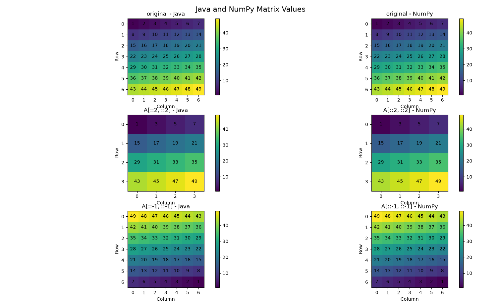

# Part 4: Matrix slicing in Python and Java


### Initial Matrix

For this task each code created `7x7` matrix filled with numbers from 1 to 49 

Numpy version:
```python
A = np.arange(1, 50).reshape(7, 7)
```

Java version:
```java
int n = 7;
int[][] A = new int[n][n];

// Fill the matrix with numbers 1 to 49
int number = 1;

for (int i = 0; i < n; i++) {
    for (int j = 0; j < n; j++) {
        A[i][j] = number;
        number++;
    }
}
```

Each code performed same slicing operations on set `A[::2, ::2]` and `A[::-1, ::-1]`

### Matrix operation in Python/Numpy vs Java

For numpy most of functionalities are already implemented using slicing without any need to use looping like in java where there is no preimplemented logic

Python Slicing:
```python
A[::2, ::2]
```

Java Slicing:
```java
int size = (n + 1) / 2;
int[][] slice1 = new int[size][size];

int row = 0;

for (int i = 0; i < n; i += 2) {

    int col = 0;

    for (int j = 0; j < n; j += 2) {
        slice1[row][col] = A[i][j];
        col++;
    }

    row++;
}
```
In Java implementation the row and column indexes increase by `2` on every iteration.

In `A[::-1, ::-1]` slicing almost similar situation happens.

Python Slicing:
```python
A[::-1, ::-1]
```

Meanwhile Java performs the same operation by accessing elements from the end and does that in a nested loop, therefore reversing whole matrix:

```java
int[][] slice2 = new int[n][n];

for (int i = 0; i < n; i++) {

    for (int j = 0; j < n; j++) {

        // Take elements from the end
        slice2[i][j] = A[n - 1 - i][n - 1 - j];
    }
}
```

To graph both codes new python code with matplotlib was created. It took json files from text file and graphs them for further review



As seen both Java and Numpy answers are similar in results.
